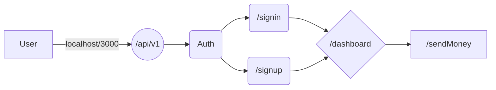

#   Basic Paytm MERN
This is a very barebone implementation of a popular online payment and transaction app PAYTM . Here . I have used MERN , to handle frontend and backend . The major implmented feature is that it incoprates transaction and authentication .

## Flow chart 
<!-- Can change this flow chart to sequece diagram by changing graph LR to  sequenceDiagram  learn more about it in -->

## Images

# Video
[paytmSample.webm](https://github.com/sumitbhuia/basic-paytm-MERN-/assets/110191269/2041daa0-6d79-4cd6-b1fd-cdf6b732618c)
